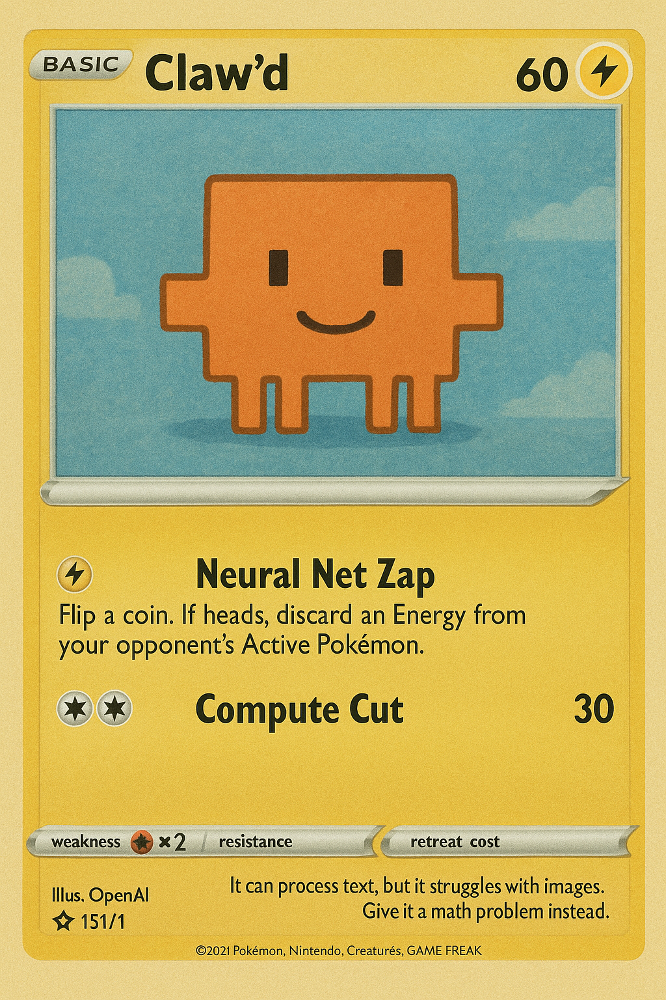

# PokeClaude

<div align="center">
  

**Pokemon Pocket TCG MCP Server & Data Scraper**

Query 2000+ Pokemon cards through Claude Desktop with AI-powered deck building, synergy finding, and strategic analysis.

[](https://opensource.org/licenses/MIT)
[](https://www.npmjs.com/package/pokemon-pocket-mcp-server)
[](https://www.npmjs.com/package/pokemon-pocket-mcp-server)

</div>

---

## ✨ Features

### 🤖 MCP Server

Build decks, find synergies, and counter strategies with AI assistance:

- **7 Powerful Tools** - Search, filter, analyze, and find card synergies
- **2077+ Cards** - Complete Pokemon Pocket TCG database
- **DuckDB-Powered** - Lightning-fast SQL queries
- **Smart Filtering** - Auto-deduplicates art variants (1068 unique cards)
- **Deck Building** - AI prompts for deck construction and optimization
- **Type Analysis** - Strategic counters and weakness exploitation

### 🔄 Auto-Updating Scraper

- **Zero Manual Updates** - Auto-discovers new sets from limitlesstcg.com
- **Incremental Sync** - Only fetches new cards (6-7 min full scrape)
- **Complete Data** - Abilities, attacks, stats, weaknesses, images
- **UUID Primary Keys** - Production-ready database schema

## 🚀 Quick Start (Published Package)

**The easiest way to use this MCP server is via npx/bunx:**

### Setup with Claude Desktop

1. Add to your Claude Desktop config:

   **macOS/Linux:** `~/Library/Application Support/Claude/claude_desktop_config.json`
   **Windows:** `%APPDATA%\Claude\claude_desktop_config.json`

   **Using npx (works with any Node installation):**

   ```json
   {
     "mcpServers": {
       "pokemon-pocket": {
         "command": "npx",
         "args": ["pokemon-pocket-mcp-server"]
       }
     }
   }
   ```

   **Using bunx (faster, requires bun):**

   ```json
   {
     "mcpServers": {
       "pokemon-pocket": {
         "command": "bunx",
         "args": ["pokemon-pocket-mcp-server"]
       }
     }
   }
   ```

2. Restart Claude Desktop

3. Start querying Pokemon cards through Claude!

> **Note:** Using npx/bunx means you don't need to install or build anything manually. The package is fetched automatically and always stays up-to-date!

### ✅ Verification

The published package has been tested and verified to work correctly:

**Test Results:**

```bash
# Both bunx and npx tested successfully
✓ Server starts and initializes DuckDB
✓ MCP protocol responds correctly
✓ All 8 tools available (search_cards, get_card, find_synergies, etc.)
✓ Database queries return card data
✓ CSV data properly bundled (2077 cards)
```

**Example Test:**

```bash
# Test with bunx
bunx pokemon-pocket-mcp-server
# Output: Pokemon Pocket MCP Server running on stdio
# Output: DuckDB initialized with Pokemon cards

# Test with npx
npx pokemon-pocket-mcp-server
# Output: Pokemon Pocket MCP Server running on stdio
# Output: DuckDB initialized with Pokemon cards
```

**Troubleshooting:**

- If the server doesn't appear in Claude Desktop, check the config file path
- Ensure you've restarted Claude Desktop after adding the configuration
- Check Claude Desktop logs: `~/Library/Logs/Claude/` (macOS)

## 🎮 Claude Code Plugin Marketplace

This repository includes a comprehensive **Claude Code plugin** for Pokemon TCG Pocket with 4 commands and 4 auto-activating skills.

### Plugin Components

✨ **Commands:**

- `/pokemon:build-deck` - Build competitive 20-card Pokemon TCG Pocket decks
- `/pokemon:analyze` - Analyze Pokemon cards or decks with detailed statistics
- `/pokemon:find-counters` - Find Pokemon and strategies that counter specific threats
- `/pokemon:meta` - Get current Pokemon TCG Pocket meta analysis and tier lists

🎯 **Skills:**

- Pokemon Deck Builder Skill - Auto-activates for deck building tasks
- Pokemon Card Analyst Skill - Auto-activates for card analysis
- Pokemon Meta Analyst Skill - Auto-activates for meta discussions
- Pokemon Skill Builder Skill - For building Claude Code skills for Pokemon

### Installation (Full Plugin)

**Install from Plugin Marketplace (Recommended)**

In Claude Code:

```
/plugin marketplace add /path/to/pokeclaude
/plugin install pokemon-tcg-pocket@pokemon-tcg-pocket-marketplace
```

**What You Get:**

- 4 Slash Commands (`/pokemon:build-deck`, `/pokemon:analyze`, `/pokemon:find-counters`, `/pokemon:meta`)
- 4 Auto-Activating Skills
- Integrated MCP Server with 7 tools
- Complete 2,077-card database

See **[PLUGIN_MARKETPLACE.md](PLUGIN_MARKETPLACE.md)** for complete installation and usage instructions.

### Quick Plugin Commands

Once installed, use these commands in Claude:

```
/pokemon:build-deck Build a Pikachu ex deck
/pokemon:analyze Analyze Charizard ex
/pokemon:find-counters What counters Lightning?
/pokemon:meta Current S-tier list
```

See **[PLUGIN_MARKETPLACE.md](PLUGIN_MARKETPLACE.md)** for complete documentation!

## 🛠️ Development Setup (For Contributors)

> **Package Manager:** This project works with both **npm** and **bun**. Use whichever you prefer!

### Clone and Install

**With npm:**

```bash
git clone https://github.com/briansunter/pokeclaude.git
cd pokeclaude
npm install
```

**With bun:**

```bash
git clone https://github.com/briansunter/pokeclaude.git
cd pokeclaude
bun install
```

### Update Card Data

**With npm:**

```bash
# Incremental update (recommended - only new cards)
npm run scrape

# Full refresh (all cards from scratch)
npm run scrape:full
```

**With bun:**

```bash
# Incremental update (recommended - only new cards)
bun run scrape

# Full refresh (all cards from scratch)
bun run scrape:full
```

### Build MCP Server

**With npm:**

```bash
npm run build
```

**With bun:**

```bash
bun run build
```

### Run Locally

After building, update your Claude Desktop config to point to your local build:

```json
{
  "mcpServers": {
    "pokemon-pocket": {
      "command": "node",
      "args": ["/absolute/path/to/pokeclaude/mcp-server/dist/index.js"]
    }
  }
}
```

## 💡 Usage Examples

### Search & Filter Cards

```
🧑 Find all Lightning Pokemon with over 100 HP
🤖 [Searches 1068 unique cards, returns Pikachu ex, Zapdos ex, Raichu, etc.]
```

### AI-Powered Deck Building

```
🧑 Build me a competitive Pikachu ex deck
🤖 [Analyzes synergies, suggests 15-18 energy cards, recommends bench sitters]
```

### Counter Strategy

```
🧑 How do I beat Mewtwo ex decks?
🤖 [Finds Darkness/Metal types that exploit Psychic weakness]
```

### Deck Analysis

```
🧑 Analyze: Charizard ex, Moltres ex, Arcanine ex
🤖 [Reports type distribution, energy needs, missing evolution basics]
```

## 🏗️ Project Structure

```
pokeclaude/
├── mcp-server/           # MCP Server (Claude Desktop integration)
│   ├── src/              # Server source code
│   ├── dist/             # Built output
│   └── README.md         # Detailed API documentation
├── scraper/              # Data scraper
│   └── src/              # Scraper source code
├── data/                 # Card database (CSV)
│   └── pokemon_pocket_cards.csv
├── claude-plugin/        # Claude Code Plugin
│   ├── commands/         # Slash commands (4)
│   ├── skills/           # Auto-activating skills (4)
│   ├── docs/             # Comprehensive research docs (23 guides)
│   │   └── pokemon-tcg-pocket-research/
│   └── README.md         # Plugin documentation
└── clawd.png            # Project logo
```

### Claude Code Plugin

The `claude-plugin/` directory contains a complete Claude Code plugin with:

- **4 Slash Commands**: `/pokemon:build-deck`, `/pokemon:analyze`, `/pokemon:find-counters`, `/pokemon:meta`
- **4 Auto-Activating Skills**: Deck building, card analysis, meta analysis, skill building
- **23 Research Guides**: 15,000+ lines covering rules, strategies, meta, card guides, and progression paths

See **[claude-plugin/README.md](./claude-plugin/README.md)** for complete plugin documentation!

## 🗄️ Database Schema

The scraper exports cards to CSV with the following structure:

| Column         | Type    | Description                      |
| -------------- | ------- | -------------------------------- |
| `id`           | UUID    | Primary key                      |
| `set_code`     | VARCHAR | Set code (A1, A2, etc.)          |
| `set_name`     | VARCHAR | Full set name                    |
| `card_number`  | VARCHAR | Card number in set               |
| `name`         | VARCHAR | Card name                        |
| `type`         | VARCHAR | Pokemon type (Fire, Water, etc.) |
| `hp`           | VARCHAR | Hit points                       |
| `rarity`       | VARCHAR | Rarity level                     |
| `abilities`    | VARCHAR | Special abilities                |
| `attacks`      | VARCHAR | Attack names and damage          |
| `weakness`     | VARCHAR | Type weakness                    |
| `resistance`   | VARCHAR | Type resistance                  |
| `retreat_cost` | VARCHAR | Retreat cost (0-4)               |
| `image_url`    | VARCHAR | Card image URL                   |
| `card_url`     | VARCHAR | limitlesstcg.com link            |

## 🔧 MCP Server Tools

| Tool             | Description                                     |
| ---------------- | ----------------------------------------------- |
| `search_cards`   | Search with filters (name, type, HP, set, etc.) |
| `get_card`       | Get specific card details                       |
| `find_synergies` | Find cards that work well together              |
| `find_counters`  | Find cards that counter a type/strategy         |
| `get_type_stats` | Get statistics by type                          |
| `query_cards`    | Run custom SQL queries                          |
| `analyze_deck`   | Analyze deck composition                        |

**Plus:** 3 AI prompts for deck building, countering, and optimization.

See **[mcp-server/README.md](./mcp-server/README.md)** for complete API documentation.

## 🎯 How Auto-Discovery Works

The scraper automatically finds new Pokemon Pocket sets:

1. Scrapes limitlesstcg.com main page
2. Discovers all set links (A1, A2, A3, A4b, P-A, etc.)
3. Compares with existing CSV data
4. Only fetches missing cards
5. Merges and exports updated database

**No manual configuration needed** - new sets appear automatically!

## 🛠️ Development

**With npm:**

```bash
# Type check all workspaces
npm run typecheck

# Build MCP server
npm run build

# Update card data
npm run scrape
```

**With bun:**

```bash
# Type check all workspaces
bun run typecheck

# Build MCP server
bun run build

# Update card data
bun run scrape
```

> **Note:** Both package managers are fully supported. Bun is faster for installation and running scripts, while npm has broader compatibility. The CI/CD pipeline uses bun for performance.

## 📊 Data Quality

- ✅ **2077 total cards** across 12 sets
- ✅ **1068 unique cards** (auto-deduplicates art variants)
- ✅ **100% validated** stats and attacks
- ✅ **Zero parsing errors** on production data
- ✅ **Complete metadata** including images and URLs

## 📝 License

MIT

---

<div align="center">
  <sub>Built with ❤️ for Pokemon Pocket TCG players</sub>
</div>
